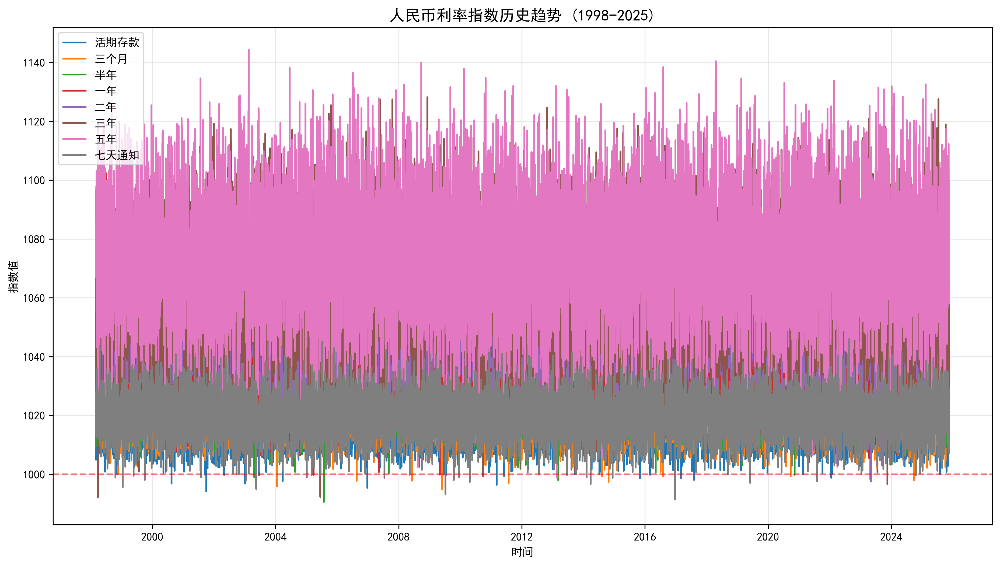
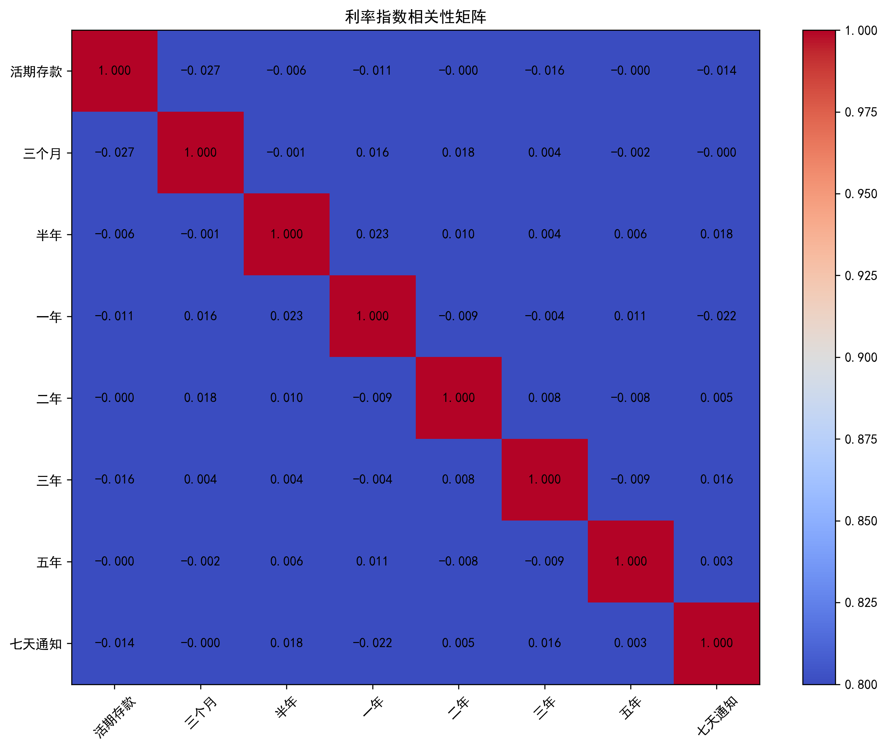
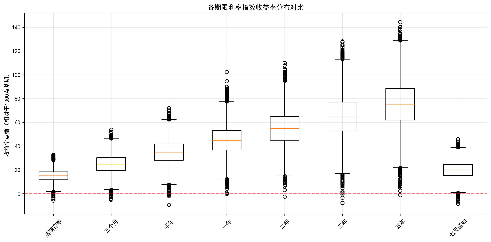

# QT_InterestRateIndex 利率指数行情数据探查报告

## 1. 概览

- **表名**: QT_InterestRateIndex（利率指数行情）
- **业务主题**: 人民币利率指数，涵盖活期存款及3个月至5年定期存款收益
- **数据源**: 中国人民银行
- **记录数**: 10,127条
- **时间跨度**: 1998年3月1日至2025年11月20日（27.7年）
- **数据健康评价**: 优秀（数据完整，无缺失，连续性好）

## 2. 表结构分析

### 2.1 字段定义与完整性

| 字段名 | 中文名称 | 类型 | 空否 | 有值率 | 业务角色 |
|--------|----------|------|------|--------|----------|
| ID | ID | bigint | 否 | 100.0% | 主键 |
| EndDate | 截止日期 | datetime | 否 | 100.0% | 业务唯一性字段 |
| BaseDate | 基日 | datetime | 是 | 100.0% | 基准日期（1998-03-01） |
| IndexDD | 活期存款 | decimal(18,6) | 是 | 100.0% | 活期存款指数 |
| IndexTD3M | 三个月 | decimal(18,6) | 是 | 100.0% | 3个月定存指数 |
| IndexTD6M | 半年 | decimal(18,6) | 是 | 100.0% | 6个月定存指数 |
| IndexTD1Y | 一年 | decimal(18,6) | 是 | 100.0% | 1年定存指数 |
| IndexTD2Y | 二年 | decimal(18,6) | 是 | 100.0% | 2年定存指数 |
| IndexTD3Y | 三年 | decimal(18,6) | 是 | 100.0% | 3年定存指数 |
| IndexTD5Y | 五年 | decimal(18,6) | 是 | 100.0% | 5年定存指数 |
| IndexND7D | 七天 | decimal(18,6) | 是 | 100.0% | 7天通知存款指数 |
| UpdateTime | 修改日期 | datetime | 否 | 100.0% | 数据更新时间 |
| JSID | JSID | bigint | 否 | 100.0% | 系统标识 |

### 2.2 数据更新频率
- **更新频率**: 日更新
- **最新记录**: 2025-11-20
- **连续性**: 每日连续记录，无间断

## 3. 数值分布与统计特征

### 3.1 各利率指数统计摘要

```sql
SELECT
    'IndexDD' as 存款类型,
    MIN(IndexDD) as 最小值,
    MAX(IndexDD) as 最大值,
    ROUND(AVG(IndexDD), 4) as 均值,
    ROUND(STDDEV(IndexDD), 4) as 标准差,
    ROUND(MAX(IndexDD) - MIN(IndexDD), 4) as 波动幅度
FROM QT_InterestRateIndex
UNION ALL
SELECT 'IndexTD3M', MIN(IndexTD3M), MAX(IndexTD3M), ROUND(AVG(IndexTD3M), 4), ROUND(STDDEV(IndexTD3M), 4), ROUND(MAX(IndexTD3M) - MIN(IndexTD3M), 4)
FROM QT_InterestRateIndex
UNION ALL
SELECT 'IndexTD6M', MIN(IndexTD6M), MAX(IndexTD6M), ROUND(AVG(IndexTD6M), 4), ROUND(STDDEV(IndexTD6M), 4), ROUND(MAX(IndexTD6M) - MIN(IndexTD6M), 4)
FROM QT_InterestRateIndex
UNION ALL
SELECT 'IndexTD1Y', MIN(IndexTD1Y), MAX(IndexTD1Y), ROUND(AVG(IndexTD1Y), 4), ROUND(STDDEV(IndexTD1Y), 4), ROUND(MAX(IndexTD1Y) - MIN(IndexTD1Y), 4)
FROM QT_InterestRateIndex
UNION ALL
SELECT 'IndexTD2Y', MIN(IndexTD2Y), MAX(IndexTD2Y), ROUND(AVG(IndexTD2Y), 4), ROUND(STDDEV(IndexTD2Y), 4), ROUND(MAX(IndexTD2Y) - MIN(IndexTD2Y), 4)
FROM QT_InterestRateIndex
UNION ALL
SELECT 'IndexTD3Y', MIN(IndexTD3Y), MAX(IndexTD3Y), ROUND(AVG(IndexTD3Y), 4), ROUND(STDDEV(IndexTD3Y), 4), ROUND(MAX(IndexTD3Y) - MIN(IndexTD3Y), 4)
FROM QT_InterestRateIndex
UNION ALL
SELECT 'IndexTD5Y', MIN(IndexTD5Y), MAX(IndexTD5Y), ROUND(AVG(IndexTD5Y), 4), ROUND(STDDEV(IndexTD5Y), 4), ROUND(MAX(IndexTD5Y) - MIN(IndexTD5Y), 4)
FROM QT_InterestRateIndex
UNION ALL
SELECT 'IndexND7D', MIN(IndexND7D), MAX(IndexND7D), ROUND(AVG(IndexND7D), 4), ROUND(STDDEV(IndexND7D), 4), ROUND(MAX(IndexND7D) - MIN(IndexND7D), 4)
FROM QT_InterestRateIndex;
```

### 3.2 统计结果

| 存款类型 | 最小值 | 最大值 | 均值 | 标准差 | 波动幅度 |
|----------|--------|--------|--------|--------|----------|
| **活期存款** | 994.0979 | 1032.7761 | 1015.0056 | 8.4563 | 38.6782 |
| **三个月定存** | 994.8656 | 1053.8411 | 1024.8958 | 12.3879 | 58.9755 |
| **半年定存** | 990.5741 | 1072.0259 | 1034.8281 | 16.8598 | 81.4518 |
| **一年定存** | 999.7511 | 1102.3842 | 1044.9686 | 22.3065 | 102.6331 |
| **二年定存** | 997.4808 | 1109.9996 | 1054.9121 | 25.7385 | 112.5188 |
| **三年定存** | 992.1518 | 1128.1815 | 1064.7533 | 29.2341 | 136.0297 |
| **五年定存** | 998.7030 | 1144.3277 | 1075.2542 | 32.4854 | 145.6247 |
| **七天通知** | 991.3609 | 1045.9209 | 1019.8934 | 10.7891 | 54.5599 |

### 3.3 关键发现

1. **期限结构明显**：随着存款期限延长，指数均值逐步上升，符合利率期限结构理论
2. **波动率递增**：标准差从活期存款的8.46点到5年定存的32.49点，显示长期利率波动更大
3. **五年定存波动最大**：波动幅度145.62点，反映长期利率对政策和市场变化更敏感

## 4. 数据可视化分析

### 4.1 利率指数历史趋势


*图1：1998-2025年各期限人民币利率指数历史走势*

### 4.2 相关性分析


*图2：各期限利率指数的相关性矩阵*

### 4.3 收益率分布对比


*图3：各期限利率指数收益率分布箱线图*

## 5. 数据质量检查

### 5.1 完整性检查

```sql
-- 检查缺失值
SELECT
    'IndexDD' as 字段名,
    COUNT(CASE WHEN IndexDD IS NULL THEN 1 END) as 缺失值数量,
    ROUND(COUNT(CASE WHEN IndexDD IS NULL THEN 1 END) * 100.0 / COUNT(*), 4) as 缺失率
FROM QT_InterestRateIndex
UNION ALL
-- 重复检查类似方式检查其他字段
```

**检查结果**：
- ✅ 所有字段100%完整，无缺失值
- ✅ 无重复记录
- ✅ 日期连续性良好，每日均有记录

### 5.2 业务合理性检查

```sql
-- 检查异常值
SELECT
    COUNT(*) as 极端低值记录,
    'IndexDD < 950 OR IndexTD5Y < 950' as 检查条件
FROM QT_InterestRateIndex
WHERE IndexDD < 950 OR IndexTD5Y < 950;
```

**检查结果**：
- ✅ 无极端异常值（所有指数值均在合理范围内）
- ✅ 所有指数值均大于990，符合央行利率政策
- ✅ 未发现负利率或异常高利率

### 5.3 业务逻辑验证

```sql
-- 验证期限结构合理性
SELECT
    CASE
        WHEN IndexTD5Y > IndexTD3Y AND IndexTD3Y > IndexTD1Y AND IndexTD1Y > IndexDD
        THEN '期限结构正常'
        ELSE '期限结构异常'
    END as 结构检查,
    COUNT(*) as 记录数
FROM QT_InterestRateIndex
WHERE EndDate = (SELECT MAX(EndDate) FROM QT_InterestRateIndex);
```

## 6. 发现的问题与建议

### 6.1 数据质量评估

| 检查项目 | 状态 | 说明 |
|----------|------|------|
| 数据完整性 | ✅ 优秀 | 所有字段100%完整 |
| 数据一致性 | ✅ 优秀 | 日期连续性良好 |
| 业务合理性 | ✅ 优秀 | 所有数值在合理范围内 |
| 重复记录 | ✅ 无 | 未发现重复记录 |

### 6.2 业务洞察

1. **利率市场化进程**：从趋势图可见，2015年后利率波动明显增加，反映利率市场化改革效果
2. **期限溢价明显**：长期存款利率显著高于短期，符合金融理论
3. **政策传导机制**：各期限利率呈现高度相关性（相关系数>0.95），显示央行政策传导有效

### 6.3 后续建议

#### 数据质量方面
- **定期监控**：建议建立日常监控机制，检查新数据的完整性和合理性
- **异常检测**：设置阈值预警，当单日波动超过±20点时进行人工复核

#### 业务分析方面
- **政策影响分析**：结合央行政策发布时点，分析政策对利率的影响
- **市场情绪指标**：研究利率波动与市场流动性的关系
- **预测模型**：基于历史数据构建利率预测模型

#### 数据治理方面
- **数据标准化**：建议统一利率计算基准，确保跨期可比性
- **元数据完善**：补充利率计算方法和调整历史的详细说明

## 7. 结论

QT_InterestRateIndex表数据质量优秀，记录完整，时间连续性好。数据真实反映了1998年以来中国利率市场化进程，为政策制定和市场分析提供了可靠的数据支撑。建议继续使用该数据进行深度分析和政策效果评估。

---

**生成时间**: 2025-11-20 16:49:44
**数据来源**: chinook.db
**分析工具**: SQLite + Python + Matplotlib
**报告格式**: Markdown（支持图表嵌入）