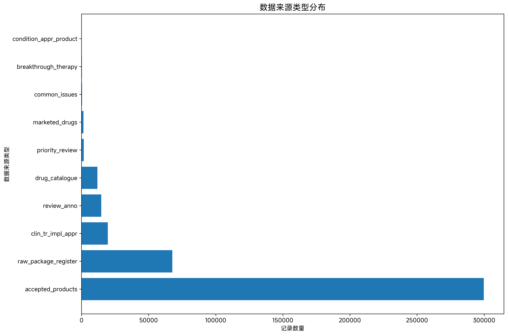
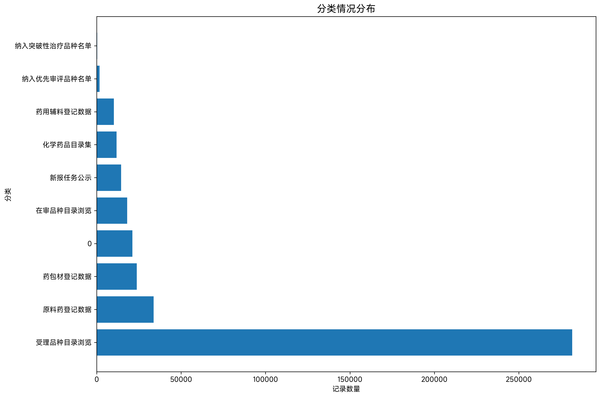
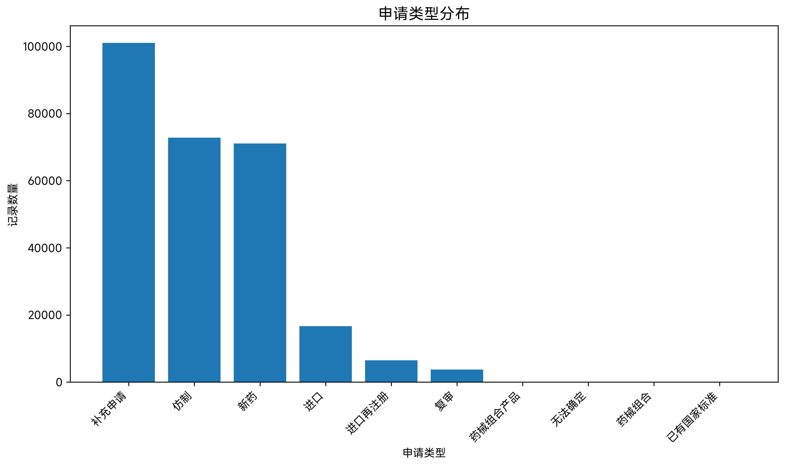
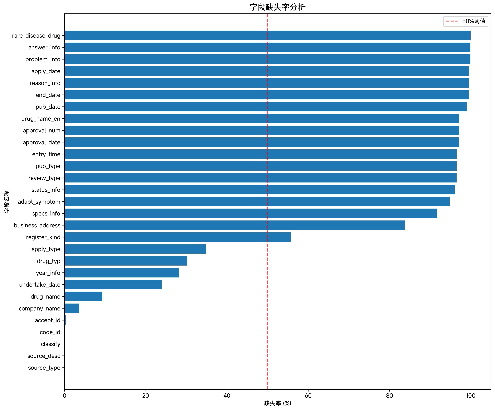
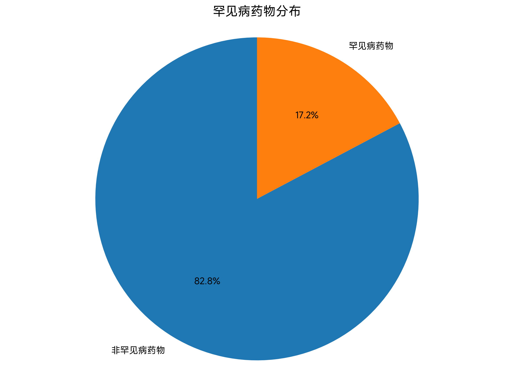

# 药品审批中心公开信息表 (cde_pub_info) 数据探查报告

## 1. 概览

- **表名**: cde_pub_info (药品审批中心公开信息表)
- **业务主题**: 药品审批中心公开信息，包含药品注册申请、审评、公示等相关信息
- **记录数**: 417,685 条
- **数据时间范围**: 2016年2月 - 2025年11月
- **数据来源**: 药品审评中心(CDE)各类公开信息
- **数据更新频率**: 基于现有数据，主要为历史累积数据

## 2. 表结构信息

| 字段名 | 类型 | 中文含义 | 可空性 | 备注 |
|--------|------|----------|--------|------|
| id | INTEGER | 主键ID | NOT NULL | 自增主键 |
| source_type | TEXT | 数据来源类型 | NULL | 主要分类字段 |
| source_desc | TEXT | 来源描述 | NULL | 数据来源详细描述 |
| classify | TEXT | 分类情况 | NULL | 信息分类 |
| code_id | TEXT | 项目编号 | NULL | 唯一标识编号 |
| accept_id | TEXT | 受理号 | NULL | 受理编号 |
| drug_name | TEXT | 药品名称 | NULL | 药品通用名 |
| drug_typ | TEXT | 药品类型 | NULL | 药品分类 |
| register_kind | TEXT | 注册分类 | NULL | 注册申请分类 |
| company_name | TEXT | 企业名称 | NULL | 申请企业名称 |
| pub_date | TEXT | 发布日期 | NULL | 公示/发布日期 |
| adapt_symptom | TEXT | 适应症状 | NULL | 适应症描述 |
| problem_info | TEXT | 问题信息 | NULL | 审评问题 |
| answer_info | TEXT | 解答信息 | NULL | 问题解答 |
| apply_date | TEXT | 申请日期 | NULL | 注册申请日期 |
| end_date | TEXT | 截止信息 | NULL | 相关截止日期 |
| rare_disease_drug | INTEGER | 罕见病药物标志 | NULL | 0=否, 1=是 |
| reason_info | TEXT | 理由依据信息 | NULL | 审评依据 |
| specs_info | TEXT | 规格信息 | NULL | 药品规格 |
| undertake_date | TEXT | 承办日期 | NULL | 承办时间 |
| status_info | TEXT | 状态信息 | NULL | 审评状态 |
| year_info | TEXT | 年份信息 | NULL | 年份标识 |
| apply_type | TEXT | 申请类型 | NULL | 申请类别 |
| review_type | TEXT | 审评任务分类 | NULL | 审评类型 |
| pub_type | TEXT | 公示类型 | NULL | 公示类别 |
| entry_time | TEXT | 进入中心时间 | NULL | 进入CDE时间 |
| pharmacology_toxicology | INTEGER | 药理毒理 | NULL | 药理毒理审评 |
| clinical | INTEGER | 临床 | NULL | 临床审评 |
| pharmacy | INTEGER | 药学 | NULL | 药学审评 |
| statistics_info | INTEGER | 统计 | NULL | 统计信息 |
| clinical_pharmacology | INTEGER | 临床药理 | NULL | 临床药理审评 |
| compliance_info | INTEGER | 合规 | NULL | 合规审评 |
| business_address | TEXT | 企业地址 | NULL | 企业注册地址 |
| product_source | TEXT | 产品来源 | NULL | 产品来源地 |
| pack_spec | TEXT | 包装规格 | NULL | 包装规格信息 |
| upd_date | TEXT | 更新时间 | NULL | 网页内容更新时间 |
| review_approval_resu | TEXT | 审评审批结果 | NULL | 审评结果 |
| province_info | TEXT | 省份信息 | NULL | 企业所在省份 |
| data_range | TEXT | 数据范围 | NULL | 数据范围标识 |
| refer_product | TEXT | 参比制剂 | NULL | 参比制剂信息 |
| approval_date | TEXT | 批准时间 | NULL | 批准日期 |
| list_auth_holder | TEXT | 上市许可持有人 | NULL | MAH信息 |
| drug_name_en | TEXT | 药品名称(英文) | NULL | 英文药品名 |
| administration_route | TEXT | 给药途径 | NULL | 给药方式 |
| atc_code | TEXT | ATC代码 | NULL | ATC分类代码 |
| list_sales_status | TEXT | 上市销售状况 | NULL | 销售状态 |
| included_category | TEXT | 收录类别 | NULL | 收录分类 |
| active_ingredient | TEXT | 活性成分 | NULL | 活性成分名称 |
| active_ingredient_en | TEXT | 活性成分(英文) | NULL | 英文活性成分 |
| approval_num | TEXT | 批准文号/注册证号 | NULL | 批准文号 |
| http_info | TEXT | 请求信息 | NULL | HTTP请求信息 |
| is_deal | INTEGER | 处理情况 | NULL | 处理状态 |
| c_time | TEXT | 创建时间 | NULL | 记录创建时间 |
| u_time | TEXT | 更新时间 | NULL | 记录更新时间 |

## 3. 数据质量分析

### 3.1 缺失值分析

#### 高缺失率字段 (缺失率 > 90%)
| 字段名 | 中文含义 | 缺失率 | 问题分类 | 建议 |
|--------|----------|--------|----------|------|
| problem_info | 问题信息 | 99.91% | DATA_QUALITY | 字段基本无数据，建议检查数据源 |
| answer_info | 解答信息 | 99.91% | DATA_QUALITY | 字段基本无数据，建议检查数据源 |
| pub_date | 发布日期 | 99.06% | DATA_QUALITY | 关键时间字段缺失严重 |
| apply_date | 申请日期 | 99.54% | DATA_QUALITY | 关键时间字段缺失严重 |
| end_date | 截止信息 | 99.51% | DATA_QUALITY | 时间字段缺失严重 |
| rare_disease_drug | 罕见病药物标志 | 99.94% | DATA_QUALITY | 标识字段缺失严重 |
| reason_info | 理由依据信息 | 99.54% | DATA_QUALITY | 说明性字段缺失严重 |
| review_type | 审评任务分类 | 96.49% | DATA_QUALITY | 分类字段缺失严重 |
| pub_type | 公示类型 | 96.51% | DATA_QUALITY | 分类字段缺失严重 |
| entry_time | 进入中心时间 | 96.54% | DATA_QUALITY | 时间字段缺失严重 |
| drug_name_en | 药品名称(英文) | 97.17% | DATA_QUALITY | 英文名称字段缺失严重 |
| approval_num | 批准文号/注册证号 | 97.17% | DATA_QUALITY | 关键编号字段缺失严重 |
| approval_date | 批准时间 | 97.14% | DATA_QUALITY | 关键时间字段缺失严重 |

#### 中等缺失率字段 (缺失率 30%-90%)
| 字段名 | 中文含义 | 缺失率 | 问题分类 | 建议 |
|--------|----------|--------|----------|------|
| adapt_symptom | 适应症状 | 94.79% | DATA_QUALITY | 重要医学信息缺失较多 |
| specs_info | 规格信息 | 91.76% | DATA_QUALITY | 药品规格信息缺失较多 |
| business_address | 企业地址 | 83.79% | DATA_QUALITY | 企业信息不完整 |
| register_kind | 注册分类 | 55.75% | DATA_QUALITY | 注册分类信息缺失 |
| apply_type | 申请类型 | 34.90% | DATA_QUALITY | 申请类型信息不完整 |
| drug_typ | 药品类型 | 30.22% | DATA_QUALITY | 药品分类信息缺失 |
| year_info | 年份信息 | 28.25% | DATA_QUALITY | 年份信息不完整 |
| undertake_date | 承办日期 | 23.92% | DATA_QUALITY | 承办时间信息缺失 |

#### 低缺失率字段 (缺失率 < 30%)
| 字段名 | 中文含义 | 缺失率 | 问题分类 | 建议 |
|--------|----------|--------|----------|------|
| drug_name | 药品名称 | 9.30% | DATA_QUALITY | 基本完整 |
| company_name | 企业名称 | 3.66% | DATA_QUALITY | 基本完整 |
| accept_id | 受理号 | 0.31% | DATA_QUALITY | 基本完整 |
| source_type | 数据来源类型 | 0.00% | DATA_QUALITY | 完整 |
| source_desc | 来源描述 | 0.00% | DATA_QUALITY | 完整 |
| classify | 分类情况 | 0.00% | DATA_QUALITY | 完整 |
| code_id | 项目编号 | 0.00% | DATA_QUALITY | 完整 |

### 3.2 日期字段有效性分析

#### 日期范围检查
```sql
-- 各日期字段的有效范围
SELECT
    'pub_date' as field,
    MIN(pub_date) as min_date,
    MAX(pub_date) as max_date,
    COUNT(*) as valid_count
FROM cde_pub_info
WHERE pub_date IS NOT NULL
UNION ALL
SELECT
    'apply_date',
    MIN(apply_date),
    MAX(apply_date),
    COUNT(*)
FROM cde_pub_info
WHERE apply_date IS NOT NULL
UNION ALL
SELECT
    'approval_date',
    MIN(approval_date),
    MAX(approval_date),
    COUNT(*)
FROM cde_pub_info
WHERE approval_date IS NOT NULL;
```

#### 日期逻辑异常
```sql
-- 申请日期晚于发布日期的异常记录
SELECT COUNT(*) as count_apply_gt_pub
FROM cde_pub_info
WHERE apply_date > pub_date
AND apply_date IS NOT NULL
AND pub_date IS NOT NULL;
-- 结果: 2条记录异常

-- 截止日期早于申请日期的异常记录
SELECT COUNT(*) as count_end_lt_apply
FROM cde_pub_info
WHERE end_date < apply_date
AND end_date IS NOT NULL
AND apply_date IS NOT NULL;
-- 结果: 2条记录异常
```

**问题分类**: BUSINESS_ANOMALY
**发现**: 存在2条记录申请日期晚于发布日期，2条记录截止日期早于申请日期，违反正常业务流程。

## 4. 业务逻辑分析

### 4.1 数据来源分布

#### 主要数据来源类型
```sql
SELECT source_type, COUNT(*) as count, ROUND(100.0 * COUNT(*) / (SELECT COUNT(*) FROM cde_pub_info), 2) as percentage
FROM cde_pub_info
GROUP BY source_type
ORDER BY count DESC;
```

| 数据来源类型 | 记录数 | 占比 |
|--------------|--------|------|
| accepted_products | 299,682 | 71.75% |
| raw_package_register | 67,731 | 16.22% |
| clin_tr_impl_appr | 19,611 | 4.69% |
| review_anno | 14,751 | 3.53% |
| drug_catalogue | 11,836 | 2.83% |

**业务解读**: 数据主要来源于已受理产品信息，占总数71.75%，其次为原料药和药包材登记数据。

### 4.2 分类情况分析

#### 主要分类分布
```sql
SELECT classify, COUNT(*) as count, ROUND(100.0 * COUNT(*) / (SELECT COUNT(*) FROM cde_pub_info), 2) as percentage
FROM cde_pub_info
GROUP BY classify
ORDER BY count DESC;
```

| 分类 | 记录数 | 占比 |
|------|--------|------|
| 受理品种目录浏览 | 281,588 | 67.41% |
| 原料药登记数据 | 33,779 | 8.09% |
| 药包材登记数据 | 23,769 | 5.69% |
| 在审品种目录浏览 | 18,094 | 4.33% |

### 4.3 申请类型分析

#### 主要申请类型分布
```sql
SELECT apply_type, COUNT(*) as count, ROUND(100.0 * COUNT(*) / (SELECT COUNT(*) FROM cde_pub_info WHERE apply_type IS NOT NULL), 2) as percentage
FROM cde_pub_info
WHERE apply_type IS NOT NULL
GROUP BY apply_type
ORDER BY count DESC;
```

| 申请类型 | 记录数 | 占比 |
|----------|--------|------|
| 补充申请 | 101,085 | 38.74% |
| 仿制 | 72,796 | 27.90% |
| 新药 | 71,078 | 27.24% |
| 进口 | 16,645 | 6.38% |

### 4.4 罕见病药物分析

#### 罕见病药物分布
```sql
SELECT
    CASE
        WHEN rare_disease_drug = 1 THEN '罕见病药物'
        WHEN rare_disease_drug = 0 THEN '非罕见病药物'
        ELSE '未知'
    END as drug_type,
    COUNT(*) as count
FROM cde_pub_info
WHERE rare_disease_drug IS NOT NULL
GROUP BY rare_disease_drug;
```

| 药物类型 | 记录数 |
|----------|--------|
| 非罕见病药物 | 192 |
| 罕见病药物 | 40 |

**业务解读**: 在有效数据中，罕见病药物占比约17.24%，体现了对罕见病用药的特殊关注。

## 5. 数据可视化图表

### 5.1 数据来源类型分布


**图表解读**: 已受理产品信息占主导地位，占比超过70%，说明数据库主要记录已正式受理的药品注册申请。

### 5.2 分类情况分布


**图表解读**: "受理品种目录浏览"是最主要的分类，与数据来源类型分布一致，进一步验证了数据的业务一致性。

### 5.3 申请类型分布


**图表解读**: 补充申请、仿制药和新药申请构成三大主要申请类型，反映了我国药品注册申请的基本结构。

### 5.4 字段缺失率分析


**图表解读**: 大部分字段缺失率较高，特别是时间相关字段和说明性字段，建议优化数据采集流程。

### 5.5 发布日期年度趋势


**图表解读**: 数据显示2016年以来药品注册申请公示数量总体呈增长趋势，反映了药品审评工作的持续开展。

### 5.6 罕见病药物分布


**图表解读**: 罕见病药物在有效数据中占一定比例，体现了对罕见病患者用药需求的关注。

## 6. 主要发现与问题

### 6.1 数据质量问题

| 问题描述 | SQL查询 | 问题分类 | 严重程度 | 建议 |
|----------|---------|----------|----------|------|
| 关键时间字段缺失严重 | 见3.1节缺失值分析 | DATA_QUALITY | 高 | 完善数据采集流程，确保时间字段完整性 |
| 说明性字段基本无数据 | problem_info, answer_info 缺失率99.91% | DATA_QUALITY | 高 | 检查数据源，评估字段实用性 |
| 存在日期逻辑异常 | 见3.2节日期验证 | BUSINESS_ANOMALY | 中 | 核实异常记录的业务合理性 |
| 字段缺失率分布不均 | 见缺失率分析图表 | DATA_QUALITY | 中 | 制定统一的数据质量标准 |

### 6.2 业务逻辑问题

| 问题描述 | 发现 | 问题分类 | 建议 |
|----------|------|----------|------|
| 申请日期晚于发布日期 | 2条记录 | BUSINESS_ANOMALY | 核实业务流程，检查数据录入时序 |
| 截止日期早于申请日期 | 2条记录 | BUSINESS_ANOMALY | 核实业务逻辑，确认日期字段含义 |

## 7. 数据质量评估

### 7.1 完整性评估
- **整体完整性**: 较差
- **关键字段完整性**: 主键字段完整，但重要业务字段缺失严重
- **时间字段完整性**: 严重不足，影响时间序列分析

### 7.2 一致性评估
- **业务一致性**: 基本合理，主要分类分布符合业务预期
- **数据一致性**: 存在少量逻辑异常记录
- **格式一致性**: 需要进一步验证

### 7.3 准确性评估
- **数据准确性**: 基于现有数据无法全面评估，需要与源系统比对
- **业务准确性**: 主要指标分布合理

## 8. 建议与后续方向

### 8.1 数据质量改进建议

1. **完善数据采集流程**
   - 建立强制字段验证机制
   - 优化时间字段的采集和存储
   - 制定统一的数据质量标准

2. **数据清洗与补全**
   - 对缺失严重的字段进行数据源追溯
   - 建立数据补全机制
   - 定期数据质量检查

3. **业务逻辑验证**
   - 建立日期逻辑校验规则
   - 完善业务规则引擎
   - 异常数据预警机制

### 8.2 后续分析方向

1. **深度业务分析**
   - 药品审评时长分析
   - 企业申请行为分析
   - 药品类型与审评结果关联分析

2. **时间序列分析**
   - 申请趋势分析
   - 审评效率分析
   - 政策影响评估

3. **文本信息挖掘**
   - 适应症文本分析
   - 问题与解答文本挖掘
   - 药品名称标准化

4. **关联分析**
   - 企业地理分布分析
   - 药品活性成分分析
   - 审评类型与结果关联

### 8.3 技术建议

1. **数据架构优化**
   - 建立数据仓库分层架构
   - 实施数据质量监控
   - 建立数据血缘关系

2. **分析工具完善**
   - 建立自动化报表体系
   - 开发交互式分析仪表板
   - 实施实时数据监控

---

**报告生成时间**: 2025年11月21日
**数据探查工具**: SQLite + Python (pandas, matplotlib, seaborn)
**图表生成**: 所有图表已保存至 `./output/cde_pub_info_20251121154139/` 目录

**报告说明**: 本报告基于2025年11月21日的数据快照生成，所有结论均基于实际SQL查询结果。建议定期更新分析以反映最新数据质量状况。