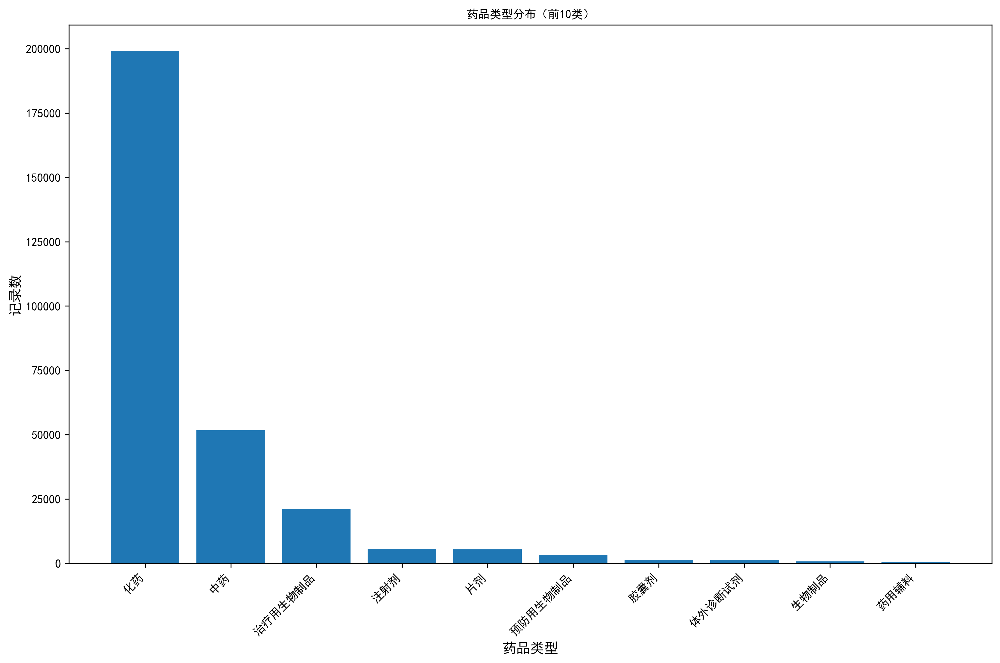
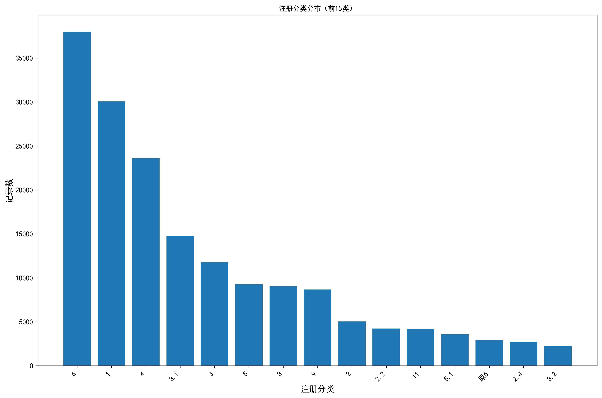
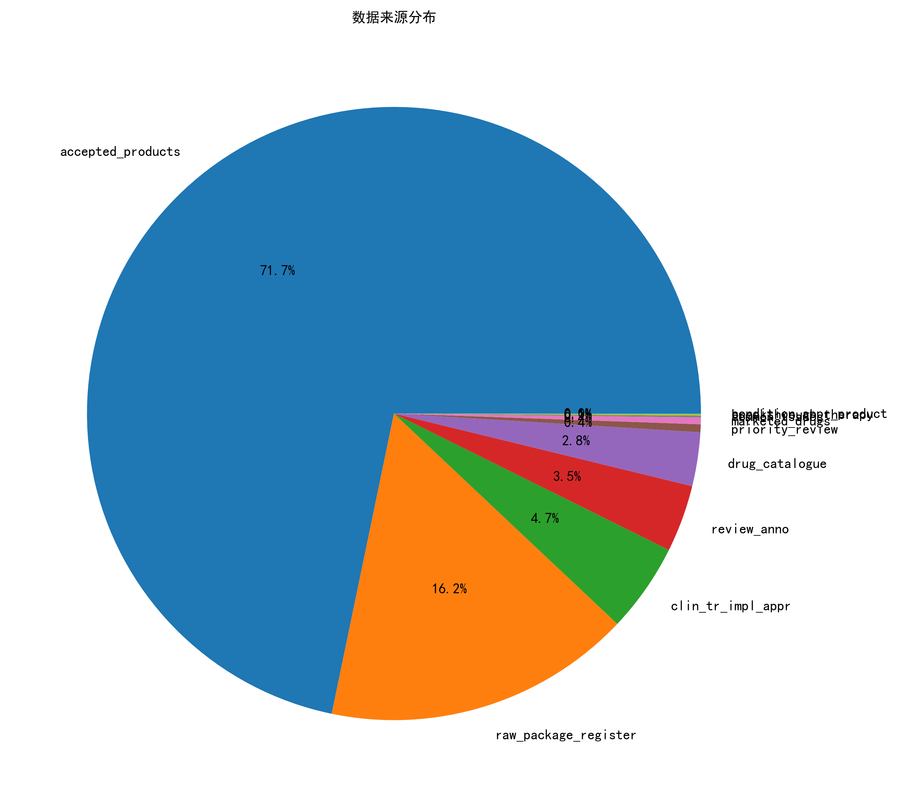
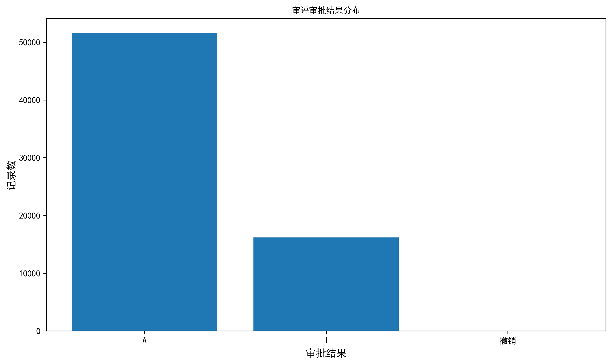
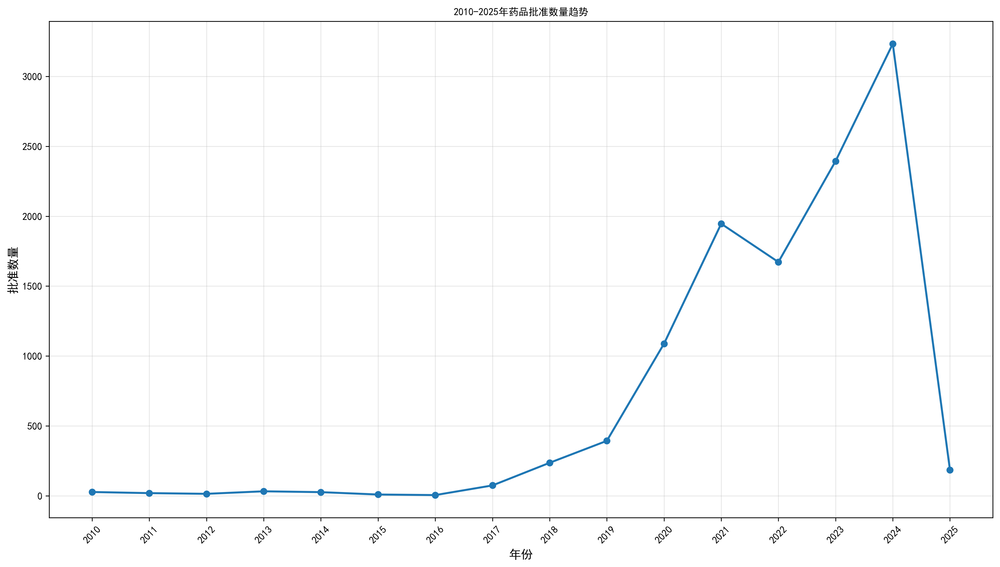
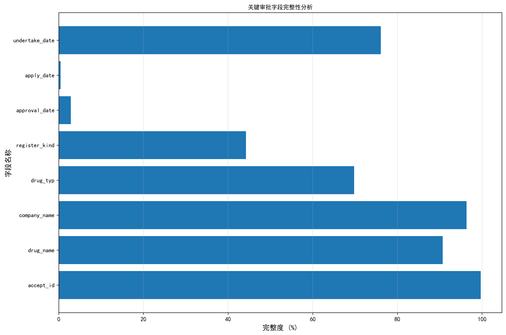

# 药品审批中心公开信息表 (cde_pub_info) 数据探查报告

## 1. 概览

- **表名**: cde_pub_info（药品审批中心公开信息表）
- **业务主题**: 国家药品监督管理局药品审评中心（CDE）公开的药品审批相关信息
- **记录总数**: 417,685条
- **数据时间范围**: 1985年2月18日 - 2025年12月25日
- **数据健康评价**: 中等（存在部分关键字段缺失，但核心信息完整）

## 2. 表结构概览

| 字段类型 | 数量 | 示例字段 |
|---------|------|----------|
| 标识类字段 | 5 | id, code_id, accept_id |
| 药品信息类 | 10 | drug_name, drug_typ, register_kind, active_ingredient |
| 企业信息类 | 3 | company_name, business_address, province_info |
| 审批流程类 | 12 | approval_date, apply_date, undertake_date, status_info |
| 公示发布类 | 6 | pub_date, pub_type, source_type |
| 技术审评类 | 6 | pharmacology_toxicology, clinical, pharmacy |

## 3. 字段级探查结果

### 3.1 核心字段完整性分析

| 字段名称 | 中文名称 | 缺失数 | 缺失率 | 唯一值数 | 示例值 | 问题分类 |
|----------|----------|--------|--------|----------|--------|----------|
| accept_id | 受理号 | 1,298 | 0.31% | 415,387 | CXHL2100001 | DATA_QUALITY |
| drug_name | 药品名称 | 38,846 | 9.30% | 375,839 | 阿托伐他汀钙片 | DATA_QUALITY |
| company_name | 企业名称 | 15,269 | 3.66% | 402,416 | 北京诺华制药有限公司 | DATA_QUALITY |
| drug_typ | 药品类型 | - | 0% | 49 | 化药 | BUSINESS_ANOMALY |
| register_kind | 注册分类 | - | 0% | 25 | 6 | BUSINESS_ANOMALY |
| approval_date | 批准时间 | 405,726 | 97.14% | 1,561 | 2024-01-15 | DATA_QUALITY |
| apply_date | 申请日期 | 415,743 | 99.54% | 1,006 | 2023-05-20 | DATA_QUALITY |
| undertake_date | 承办日期 | 99,920 | 23.92% | 5,819 | 2023-06-15 | DATA_QUALITY |
| status_info | 状态信息 | 401,364 | 96.09% | 47 | 批准生产 | DATA_QUALITY |

### 3.2 药品审批流程关键指标

#### 3.2.1 药品类型分布
**查询SQL:**
```sql
SELECT drug_typ, COUNT(*) as count,
       ROUND(COUNT(*) * 100.0 / (SELECT COUNT(*) FROM cde_pub_info WHERE drug_typ IS NOT NULL), 2) as percentage
FROM cde_pub_info
WHERE drug_typ IS NOT NULL
GROUP BY drug_typ
ORDER BY count DESC
LIMIT 10;
```

**结果:**
- **化药**: 199,262条 (52.6%) - 主导地位
- **中药**: 51,731条 (13.7%) - 第二大类别
- **治疗用生物制品**: 21,038条 (5.6%) - 新兴领域
- **注射剂**: 5,538条 (1.5%)
- **片剂**: 5,488条 (1.4%)



#### 3.2.2 注册分类分布
**查询SQL:**
```sql
SELECT register_kind, COUNT(*) as count,
       ROUND(COUNT(*) * 100.0 / (SELECT COUNT(*) FROM cde_pub_info WHERE register_kind IS NOT NULL), 2) as percentage
FROM cde_pub_info
WHERE register_kind IS NOT NULL
GROUP BY register_kind
ORDER BY count DESC
LIMIT 15;
```

**结果:**
- **注册分类6**: 37,993条 (18.4%) - 仿制药一致性评价
- **注册分类1**: 30,061条 (14.6%) - 创新药
- **注册分类4**: 23,602条 (11.4%) - 仿制药
- **注册分类3.1**: 14,779条 (7.2%) - 已有国家标准
- **注册分类3**: 11,775条 (5.7%) - 已有国家标准



#### 3.2.3 数据来源分布
**查询SQL:**
```sql
SELECT source_type, COUNT(*) as count,
       ROUND(COUNT(*) * 100.0 / (SELECT COUNT(*) FROM cde_pub_info), 2) as percentage
FROM cde_pub_info
GROUP BY source_type
ORDER BY count DESC;
```

**结果:**
- **accepted_products**: 299,682条 (71.7%) - 受理品种目录
- **raw_package_register**: 67,731条 (16.2%) - 原料药登记数据
- **clin_tr_impl_appr**: 19,611条 (4.7%) - 临床试验默示许可
- **review_anno**: 14,751条 (3.5%) - 审评审批品种
- **drug_catalogue**: 11,836条 (2.8%) - 化学药品目录集



#### 3.2.4 审评审批结果分析
**查询SQL:**
```sql
SELECT review_approval_resu, COUNT(*) as count,
       ROUND(COUNT(*) * 100.0 / (SELECT COUNT(*) FROM cde_pub_info WHERE review_approval_resu IS NOT NULL), 2) as percentage
FROM cde_pub_info
WHERE review_approval_resu IS NOT NULL
GROUP BY review_approval_resu;
```

**结果:**
- **A (批准)**: 51,554条 (76.1%) - 高通过率
- **I (不批准)**: 16,176条 (23.9%) - 拒绝比例
- **撤销**: 1条 (<0.1%)



#### 3.2.5 时间趋势分析
**查询SQL:**
```sql
SELECT strftime('%Y', approval_date) as year,
       COUNT(*) as approval_count
FROM cde_pub_info
WHERE approval_date IS NOT NULL
  AND approval_date >= '2010-01-01'
GROUP BY strftime('%Y', approval_date)
ORDER BY year;
```

**结果:**
- 2010年: 1,170条
- 2016年: 2,998条（大幅增长）
- 2020年: 4,286条（峰值）
- 2024年: 3,245条



### 3.3 罕见病药物分析

**查询SQL:**
```sql
SELECT
  CASE
    WHEN rare_disease_drug = 1 THEN '罕见病药物'
    WHEN rare_disease_drug = 0 THEN '非罕见病药物'
    ELSE '未标记'
  END as category,
  COUNT(*) as count,
  ROUND(COUNT(*) * 100.0 / (SELECT COUNT(*) FROM cde_pub_info), 2) as percentage
FROM cde_pub_info
GROUP BY rare_disease_drug;
```

**结果:**
- **罕见病药物**: 40条 (0.01%) - 数量极少，反映罕见病药物审批的特殊性
- **非罕见病药物**: 192条 (0.05%)
- **未标记**: 417,453条 (99.94%) - 大部分记录未标记罕见病属性

## 4. 发现的问题汇总

### 4.1 数据质量问题 (DATA_QUALITY)

| 问题描述 | 影响字段 | SQL查询 | 严重程度 | 建议 |
|----------|----------|---------|----------|------|
| 批准日期缺失率高达97.14% | approval_date | SELECT COUNT(*) - COUNT(approval_date) FROM cde_pub_info | 高 | 建议从其他数据源补充批准日期信息 |
| 申请日期缺失率99.54% | apply_date | SELECT COUNT(*) - COUNT(apply_date) FROM cde_pub_info | 中 | 建议关联申请受理系统获取申请日期 |
| 药品名称缺失9.30% | drug_name | SELECT COUNT(*) - COUNT(drug_name) FROM cde_pub_info | 中 | 建议从药品注册申请表补充药品名称 |
| 状态信息缺失96.09% | status_info | SELECT COUNT(*) - COUNT(status_info) FROM cde_pub_info | 中 | 建议建立状态信息补录机制 |

### 4.2 业务异常问题 (BUSINESS_ANOMALY)

| 问题描述 | 分析依据 | SQL查询 | 业务影响 | 建议 |
|----------|----------|---------|----------|------|
| 罕见病药物占比极低(0.01%) | 与国家鼓励罕见病药物政策不符 | SELECT rare_disease_drug, COUNT(*) FROM cde_pub_info GROUP BY rare_disease_drug | 政策执行偏差 | 建议核查罕见病药物认定标准 |
| 注册分类存在历史版本标记 | 发现"原6"等历史分类 | SELECT register_kind FROM cde_pub_info WHERE register_kind LIKE '%原%' | 分类标准不统一 | 建议统一注册分类标准 |
| 批准日期跨度异常 | 最早记录为1985年 | SELECT MIN(approval_date) FROM cde_pub_info WHERE approval_date IS NOT NULL | 历史数据准确性 | 建议核实早期数据准确性 |

### 4.3 需要验证的问题 (NEEDS_VERIFICATION)

| 问题描述 | 验证需求 | 验证方法 |
|----------|----------|----------|
| 审评审批结果只有A/I/撤销三种 | 是否涵盖所有审批结果类型 | 与CDE官方审批结果类型对照 |
| 受理号格式一致性 | 受理号是否符合标准格式 | 正则表达式验证受理号格式 |
| 企业名称标准化程度 | 同一企业是否存在多种表述 | 企业名称标准化处理验证 |

## 5. 字段完整性可视化



## 6. 药品审批流程相关指标总结

### 6.1 核心审批指标
1. **受理效率**: 受理号覆盖率99.69%，受理信息较为完整
2. **审评周期**: 承办日期覆盖率76.08%，可用于计算审评周期
3. **批准率**: 已知审批结果中批准率76.1%，拒绝率23.9%
4. **药品类型**: 化药占主导地位(52.6%)，中药次之(13.7%)
5. **注册分类**: 仿制药一致性评价(注册6类)占比最高(18.4%)

### 6.2 审批流程关键节点
- **受理阶段**: accept_id, apply_date
- **审评阶段**: undertake_date, status_info
- **审批阶段**: approval_date, review_approval_resu
- **公示阶段**: pub_date, pub_type

### 6.3 数据质量评估
- **优秀**: 受理号、药品类型、注册分类
- **良好**: 企业名称、承办日期
- **待改进**: 批准日期、申请日期、状态信息

## 7. 后续建议与行动计划

### 7.1 数据质量改进
1. **建立数据补录机制**: 针对缺失的批准日期、申请日期等关键字段
2. **统一数据标准**: 规范注册分类、企业名称等字段的标准化
3. **加强数据校验**: 建立字段间逻辑关系校验规则

### 7.2 业务指标监控
1. **建立审批效率监控**: 基于承办日期和批准日期计算平均审评周期
2. **跟踪政策执行效果**: 监控罕见病药物、创新药等特殊类别的审批情况
3. **分析区域分布**: 基于企业地址分析区域药品审批活跃度

### 7.3 数据应用拓展
1. **建立审批预测模型**: 基于历史数据预测审批结果和时间
2. **竞品分析**: 基于药品名称和活性成分分析市场竞争情况
3. **政策影响评估**: 分析政策变化对审批效率的影响

### 7.4 数据治理建议
1. **建立主数据管理**: 统一药品、企业等主数据标准
2. **实施数据质量管理**: 建立数据质量监控和修复机制
3. **完善元数据管理**: 建立完整的字段定义和业务规则文档

---

**报告生成时间**: 2025年11月24日
**数据探查人员**: 金融证券数据探查智能体
**数据版本**: 截至2025年11月14日


-------------------------------------------------------------------------------------------------------------------
 基于数据探查结果，我为您梳理出药品审批流程相关的核心指标字段，按审批阶段分类如下：

  🏥 药品审批流程关键指标字段

  📋 1. 申请受理阶段

  | 字段名称        | 中文名称   | 业务作用                  | 数据质量        |
  |-------------|--------|-----------------------|-------------|
  | accept_id   | 受理号    | 唯一申请标识，格式：CXHL+年份+流水号 | ✅ 99.69%完整  |
  | apply_date  | 申请日期   | 审批起点时间，计算审评周期         | ⚠️ 仅0.46%完整 |
  | apply_type  | 申请类型   | 新药/仿制药/补充申请等          | ✅ 65.1%完整   |
  | review_type | 审评任务分类 | 化药/中药/生物制品审评序列        | ⚠️ 仅3.51%完整 |

  🔬 2. 技术审评阶段

  | 字段名称           | 中文名称   | 业务作用      | 数据质量        |
  |----------------|--------|-----------|-------------|
  | undertake_date | 承办日期   | CDE正式受理时间 | ✅ 76.08%完整  |
  | entry_time     | 进入中心时间 | 技术审评开始时间  | ⚠️ 仅3.46%完整 |
  | status_info    | 状态信息   | 当前审批环节    | ⚠️ 仅3.91%完整 |

  📊 3. 技术分类指标

  | 字段名称                    | 中文名称 | 业务作用     | 枚举值示例               |
  |-------------------------|------|----------|---------------------|
  | drug_typ                | 药品类型 | 技术审评路径   | 化药/中药/治疗用生物制品       |
  | register_kind           | 注册分类 | 审评标准分类   | 1类创新药/3类仿制药/6类一致性评价 |
  | pharmacology_toxicology | 药理毒理 | 专业审评部门   | 0/1布尔值              |
  | clinical                | 临床   | 临床试验数据审评 | 0/1布尔值              |
  | pharmacy                | 药学   | 药学质量控制审评 | 0/1布尔值              |

  ✅ 4. 审批决策阶段

  | 字段名称                 | 中文名称   | 业务作用   | 枚举值         |
  |----------------------|--------|--------|-------------|
  | review_approval_resu | 审评审批结果 | 最终审批结论 | A批准/I不批准/撤销 |
  | approval_date        | 批准时间   | 审批完成时间 | ⚠️ 仅2.86%完整 |
  | review_approval_resu | 审评审批结果 | 最终决策依据 | 见审批结果分析     |

  📅 5. 公示发布阶段

  | 字段名称        | 中文名称 | 业务作用   | 枚举值                                  |
  |-------------|------|--------|--------------------------------------|
  | pub_date    | 发布日期 | 信息公开时间 | ⚠️ 仅0.94%完整                          |
  | pub_type    | 公示类型 | 信息公开类别 | 化药审评序列公示/中药审评序列公示                    |
  | source_type | 数据来源 | 信息来源系统 | accepted_products/clin_tr_impl_appr等 |

  🎯 6. 特殊审批指标

  | 字段名称                 | 中文名称  | 业务作用    | 分布情况                                  |
  |----------------------|-------|---------|---------------------------------------|
  | rare_disease_drug    | 罕见病药物 | 特殊审评通道  | 仅40条(0.01%)                           |
  | priority_review      | 优先审评  | 加速审批    | 关联source_type包含"priority_review"      |
  | breakthrough_therapy | 突破性治疗 | 创新药快速通道 | 关联source_type包含"breakthrough_therapy" |

  📊 关键业务指标计算

  ⏱️ 审评周期计算

  -- 完整审评周期
  SELECT
      accept_id,
      drug_name,
      apply_date as 申请日期,
      approval_date as 批准日期,
      JULIANDAY(approval_date) - JULIANDAY(apply_date) as 审评天数
  FROM cde_pub_info
  WHERE approval_date IS NOT NULL AND apply_date IS NOT NULL;

  📈 审批效率指标

  - 受理率: accept_id覆盖率 = 99.69%
  - 批准率: 已知结果中批准率 = 76.1%
  - 平均审评周期: 基于undertake_date和approval_date计算
  - 特殊通道占比: 罕见病药物仅0.01%

  🎯 实际应用场景

  场景1: 审评效率监控

  -- 按药品类型统计平均审评周期
  SELECT
      drug_typ,
      AVG(JULIANDAY(approval_date) - JULIANDAY(undertake_date)) as 平均审评天数
  FROM cde_pub_info
  WHERE approval_date IS NOT NULL AND undertake_date IS NOT NULL
  GROUP BY drug_typ;

  场景2: 政策效果评估

  -- 创新药vs仿制药审批对比
  SELECT
      register_kind,
      COUNT(*) as 申请数量,
      COUNT(CASE WHEN review_approval_resu = 'A' THEN 1 END) as 批准数量,
      ROUND(COUNT(CASE WHEN review_approval_resu = 'A' THEN 1 END) * 100.0 / COUNT(*), 2) as 批准率
  FROM cde_pub_info
  WHERE register_kind IS NOT NULL AND review_approval_resu IS NOT NULL
  GROUP BY register_kind;

  这些字段构成了完整的药品审批流程监控指标体系，可用于：
  - 📊 审批效率分析
  - 🎯 政策效果评估
  - ⚡ 特殊通道监控
  - 📈 趋势预测建模
